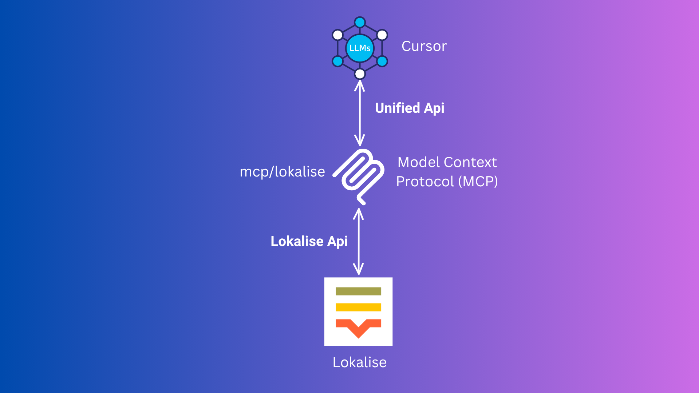
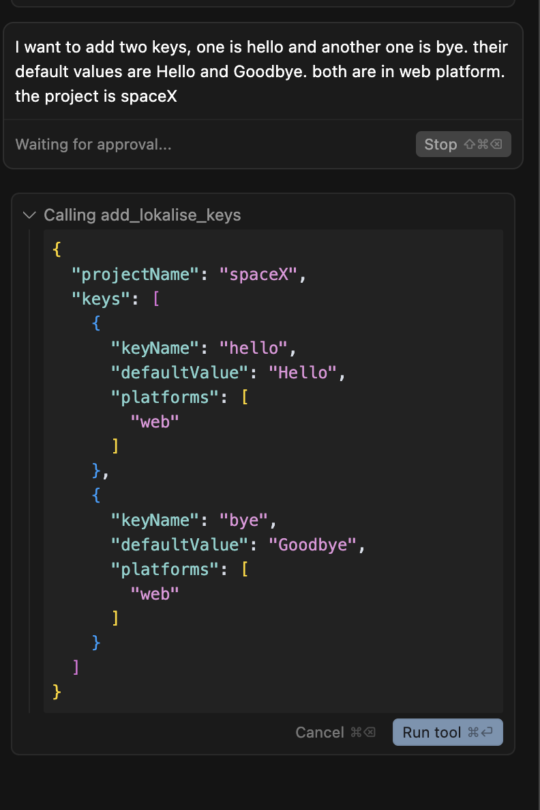

# Lokalise MCP Tool

A Minimal Command-line Program (MCP) server for adding translation keys to your Lokalise projects, designed for integration with [Cursor](https://www.cursor.so/) or standalone use.

## 📦 Installation

```bash
# For MCP usage (global installation)
npm install -g lokalise-mcp-server

# For library usage (project dependency)
npm install lokalise-mcp-server
```

**NPM Package**: https://www.npmjs.com/package/lokalise-mcp-server

---
## 🖼️ MCP Flow Diagram



*This diagram illustrates the Model Context Protocol (MCP) flow between Cursor, your MCP server, and Lokalise.* 

## ⚡️ Usage (Quick Start with Cursor MCP)

### **Option 1: NPM Package (Recommended)**

1. 📦 Install the package globally:
   ```bash
   npm install -g lokalise-mcp-server
   ```

2. 🛠️ Add this to your `mcp.json` (or configure via Cursor UI):
   ```json
   {
     "mcpServers": {
       "lokalise": {
         "command": "npx",
         "args": ["lokalise-mcp-server"],
         "env": {
           "LOKALISE_API_KEY": "your_actual_api_key"
         }
       }
     }
   }
   ```

3. 🔄 **Restart Cursor.** It will automatically use the npm package.

### **Option 2: Docker (Alternative)**

**No need to run Docker or Podman manually!**

1. 🐳 Make sure Docker or Podman is installed and running.
2. 🛠️ Add this to your `mcp.json` (or configure via Cursor UI):

   ```json
   {
     "mcpServers": {
       "lokalise": {
         "command": "docker", // podman
         "args": [
           "run",
           "--rm",
           "-i",
           "-e", "LOKALISE_API_KEY",
           "rafee03/mcp-lokalise:latest"
         ],
         "env": {
           "LOKALISE_API_KEY": "your_actual_api_key"
         }
       }
     }
   }
   ```

   - You can use `podman` instead of `docker` if you prefer.
   - Cursor will automatically pull and run the image as needed.

3. 🔄 **Restart Cursor.** It will handle everything for you.

---

## 📝 How to Use in Cursor

This tool takes these inputs:

- **projectName** (required): The name of your Lokalise project (e.g., `SpaceX`).
- **keys** (required): An array of objects, each with:
  - **keyName** (required): The translation key (e.g., `hello`)
  - **defaultValue** (optional): The default translation value (e.g., `Hello`)
  - **platforms** (optional): The platforms this key applies to (e.g., `web`, `ios`)

**Example:**
> I want to add two keys, one is hello and another one is bye. their default values are Hello and Goodbye. both are in web platform. the project is spaceX 

Cursor will automatically convert this to the correct input for the MCP tool.




---
## 📁 Project Files

**TypeScript Source Files (src/):**
- **src/mcp-server.ts**: The main MCP server entry point for Cursor integration.
- **src/mcp.ts**: Shared logic for interacting with the Lokalise API (used by the server).
- **src/server.ts**: (Optional) HTTP server version (not required for Cursor).
- **src/add-key.ts**: (Optional) CLI tool for adding a key interactively (not required for Cursor).

**Compiled JavaScript Files (dist/):**
- **dist/mcp-server.js**: Compiled MCP server.
- **dist/mcp.js**: Compiled API logic.
- **dist/server.js**: Compiled HTTP server.
- **dist/add-key.js**: Compiled CLI tool.

**Other Files:**
- **tsconfig.json**: TypeScript configuration.
- **Dockerfile**: For building the Docker image of the MCP server.
- **package.json**: Project dependencies and scripts.
- **README.md**: This documentation file.

---

## 🛠️ Setup (For Local Development or Customization)

### 1. 📥 Clone the Repository
```sh
git clone https://github.com/mdrafee03/mcp-lokalise.git
cd mcp-lokalise
```

### 2. 📦 Install Dependencies
```sh
npm install
```

### 3. 🔨 Build the Project
```sh
npm run build
```

### 4. 🔑 Set Your Lokalise API Key

In your MCP config (recommended for Cursor)
```json
{
  "mcpServers": {
    "lokalise": {
      "command": "node",
      "args": ["{directory-of-the-project}/dist/mcp-server.js"],
      "env": {
        "LOKALISE_API_KEY": "your_actual_api_key"
      }
    }
  }
}
```

---

## 🐳 MCP Server Setup Options for Cursor

You can set up the MCP server in Cursor in three ways:

### Option 1: NPM Package (Easiest)
```json
{
  "mcpServers": {
    "lokalise": {
      "command": "npx",
      "args": ["lokalise-mcp-server"],
      "env": {
        "LOKALISE_API_KEY": "your_actual_api_key"
      }
    }
  }
}
```
- First install globally: `npm install -g lokalise-mcp-server`
- Uses the published npm package directly
- No Docker or local setup required

### Option 2: Node.js (Direct Script)
```json
{
  "mcpServers": {
    "lokalise": {
      "command": "node",
      "args": ["/absolute/path/to/dist/mcp-server.js"],
      "env": {
        "LOKALISE_API_KEY": "your_actual_api_key"
      }
    }
  }
}
```
- Replace `/absolute/path/to/dist/mcp-server.js` with the full path to your compiled `dist/mcp-server.js` file.
- This runs the MCP server directly with Node.js.

### Option 3: Docker (or Podman)
```json
{
  "mcpServers": {
    "lokalise": {
      "command": "docker", // or "podman"
      "args": [
        "run",
        "--rm",
        "-i",
        "-e", "LOKALISE_API_KEY",
        "rafee03/mcp-lokalise:latest"
      ],
      "env": {
        "LOKALISE_API_KEY": "your_actual_api_key"
      }
    }
  }
}
```
- This will pull and run the published Docker image automatically.
- You can use `"command": "podman"` if you prefer Podman.

---

**💡 Note:** Both options require you to set your Lokalise API key in the `env` section. Cursor will handle starting the MCP server for you.

---

## 📚 Using as a Node.js Library

Install the package as a dependency in your project:
```bash
npm install lokalise-mcp-server
```

### **API Client Usage:**
```typescript
import { LokaliseApiClient, createLokaliseClient } from 'lokalise-mcp-server';

// Option 1: Direct instantiation
const client = new LokaliseApiClient('your-api-key');

// Option 2: Using the convenience function (uses env var if no key provided)
const client = createLokaliseClient(); // Uses LOKALISE_API_KEY env var
const client = createLokaliseClient('your-api-key'); // Uses provided key

// API usage examples
const projects = await client.getProjects();
const project = await client.findProjectByName('My Project');
const result = await client.createKeys(project.project_id, {
  keys: [
    {
      key_name: 'hello_world',
      platforms: ['web'],
      translations: [{ language_iso: 'en', translation: 'Hello World' }]
    }
  ]
});
```

### **MCP Server Integration:**
```typescript
import { LokaliseMCPServer } from 'lokalise-mcp-server/server';

// Create and run your own MCP server instance
const server = new LokaliseMCPServer();
await server.run();
```

### **Utility Functions:**
```typescript
import { parseCommand, addKeysToProject } from 'lokalise-mcp-server';

// Parse natural language commands
const parsed = parseCommand('project name is "MyApp". Add key hello with value "Hello World"');

// Add keys directly
const result = await addKeysToProject({
  apiKey: 'your-api-key',
  projectName: 'MyApp',
  keys: [{ keyName: 'hello', defaultValue: 'Hello World' }]
});
```

---

## 🧑‍💻 Development

### Available Scripts
- `npm run build` - Compile TypeScript to JavaScript
- `npm run dev` - Run the MCP server in development mode with tsx
- `npm run server` - Run the HTTP server in development mode with tsx
- `npm run add-key` - Run the CLI tool in development mode with tsx
- `npm start` - Run the compiled MCP server from dist/

### Requirements
- Node.js 22+ recommended
- TypeScript 5.8+
- MCP protocol via [@modelcontextprotocol/sdk](https://www.npmjs.com/package/@modelcontextprotocol/sdk)

---

## License
MIT 


